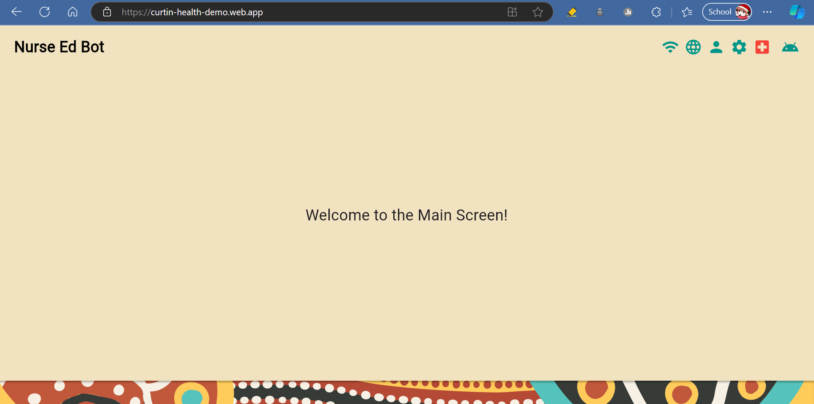
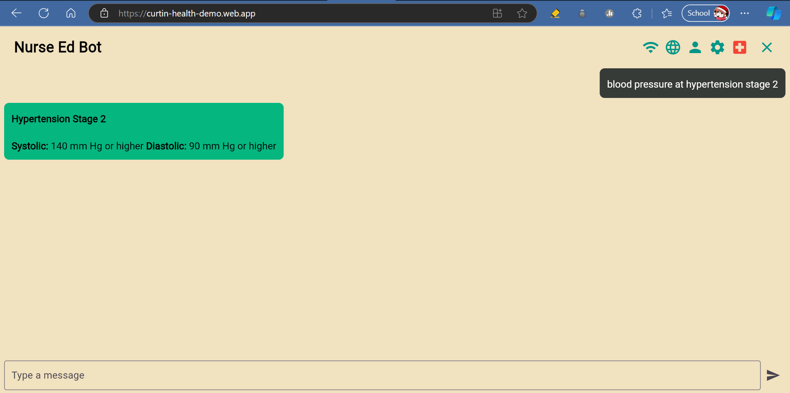

# Medi-Kit Chatbot for Curtin Health Project
Project for the subject COMP30022 IT Project in 2024 Semester 2.

## Table of Contents
- [Project Background](#project-background)
    * [Description](#description)
    * [Related Technology](#related-technology)
    * [Team Members](#team-members)
    * [System Requirements](#system-requirements)
- [Demo](#demo)
- [Components and Folder Structure](#components-and-folder-structure)
- [Installation and Deployment](#installation-and-deployment)
    * [Preparation](#preparation)
    * [Remote deployment](#remote-deployment)
    * [Local deployment](#local-deployment)
    * [Description of key algorithms](#description-of-key-algorithms)
    * [Database overview](#database-structure-overview)
- [Handover Documentations](#handover-documentations)

## Project Background
### Description
Our client is the development team of the Medi-Kit (https://research.curtin.edu.au/research-areas/healthy-communities/healthy-connections/), which is a product aims to help support healthcare workers in the process of delivering healthcare to people of the Pilbara region. The product is mainly used by these healthcare workers.

The chatbot is a component of the Medi-Kit, where it aims to provide real-time suggestions and feedback to healthcare workers for appropriate approaches to patients' symptoms, and for appropriate questions to ask patients regarding their conditions. The chatbot's area of focus is on issues that are related to blood pressure.

### Related Technology
The application is built with Flutter for frontend user interface, and Python-Flask for backend chatbot model to handle users' queries and generate answers. The chatbot used an open-souce LLM Model [Google Gemini](https://ai.google.dev/gemini-api) to generate responses to user queries, enhanced with RAG (Retrieval-Augmented Generation) for a more context-aware and informative response using [Qdrant FastEmbbed](https://github.com/qdrant/fastembed) - a light-weight embeddding model.

For deployment, this project uses [Heroku](https://dashboard.heroku.com/) for backend server deployment and [Firebase](https://firebase.google.com/products/hosting) for frontend hosting (demo). 

### Team Members
| Name                  | Student ID        | Email                                 | GitHub        |
| --------------------- | ----------------- | ------------------------------------- | ---------     |
| Annabel Sutherland    |    1353331        | sutherlandaj@student.unimelb.edu.au   | f1ckl3p1ckl3  |
| Duc Minh Do           |    1318517        | ducminhd@student.unimelb.edu.au       | minhddo       |
| Leslie Nguyen         |    1280163        | ngocuyenphuo@student.unimelb.edu.au   | Leslie2101    |
| Ngoc Huy Nguyen       |    1302055        | ngochuyn@student.unimelb.edu.au       | ankeocunghuy  |
| Sean Chen             |    1180957        | siyang.chen4@student.unimelb.edu.au   | seanchen8     |

### System Requirements
- [git](https://github.com/git-guides/install-git)
- [Flutter](https://docs.flutter.dev/get-started/install) (version 3.24.3)
- [Python](https://www.python.org/downloads/) (version 3.11.8)
- [pip](https://pip.pypa.io/en/stable/installation/) (version 24.2)

> [!TIP] 
> The project targets iOS apps, which is the priority of our developments, so it would be best to be tested on systems with macOS installed and [Flutter components for developing iOS apps](https://docs.flutter.dev/get-started/install/macos/mobile-ios)
>
> Although not ideal, the project can still be tested with different tooling sets (for [Android apps on Linux](https://docs.flutter.dev/get-started/install/linux/android), [Android apps on Windows](https://docs.flutter.dev/get-started/install/windows/mobile), ...) with operating systems that are not macOS.


## Demo 
Webapp with Firebase: https://curtin-health-demo.web.app/

Example Heroku Backend Server: https://curtin-chatbot-project-9262c06ae75b.herokuapp.com/

\* Demo can be tested with information from ```utils/``` for RAG response. 




## Components and folder structure
The chatbot is made of two components, which run with different frameworks, the frontend uses Flutter, while the backend uses Python. Also the project is open to deployed locally and remotely.
1. **Flutter frontend** in the `frontend/` directory
2. **Python backend** in the `backend/` directory

Here is the folder structure of the project (for notable directories and files):
```
root/
├── backend/
|   ├── utils/              # Directory for reference resource for RAG model 
|   ├── tests/              # Directory for unit testing for backend 
|   ├── model pre-training/ # Directory for fine-tuning model 
|   ├── app.py              # Main Flask app to handle request from frontend 
|   ├── llmmodel.py         # Encapsulate interaction with Gemini API
|   ├── ragmodel.py         # Encapsulate Rag model using Qdrant for embedding 
|   ├── preprocess.py       # Encapsulate all functions for RAG source file processing 
|   ├── requirements.txt    # Dependencies for Python
|   └── wsgi.py, Procfile   # Required files for Heroku deployment
├── frontend/myapp/
|   ├── lib/                # Main directory for frontend source code
|   |   ├── Config.dart     # Config backend server url here 
|   |   ├── main.dart       # Main Flutter app
|   |   └── homepage.dart   # Chat conversation frontend
|   └── test/               # Directory for unit testing for Flutter
├── docs/                   # Architectural design and product requirements
└── tests/                  # Test plan and test cases 
```

## Installation and Deployment
### Preparation
In order to configure the application properly, you need to create a `.env` file in the root directory of your project. This file will store environment-specific variables such as API keys. 

#### Setup API Accounts
Create accounts for [Google Gemini API](https://ai.google.dev/gemini-api), [Heroku](https://signup.heroku.com/), [QdrantCloud](https://cloud.qdrant.io/) and [Firebase](https://firebase.google.com/products/hosting).


For Heroku, create a project called ```curtin-chatbot-project```

For Firebase, create a project called ```curtin-health-demo```

#### Setup Environment Variables

1. In the root directory of your project, create a new file named `.env`.
   
2. Add the required variables to this file using API keys from your [Google Gemini API](https://ai.google.dev/gemini-api), [Heroku](https://signup.heroku.com/)*, [QdrantCloud](https://cloud.qdrant.io/) and [Firebase](https://firebase.google.com/products/hosting) accounts. 

```bash
# Example of .env file
QDRANT_URL="https://xxxxxx.us-east4-0.gcp.cloud.qdrant.io:6333"   
QDRANT_API_KEY="<your-qdrant-cloud-api-key>"
GOOGLE_API_KEY="<your-gemini-api-key>"
HEROKU_API_KEY="<your-heroku-api-key>"    
```

3. Add these variables to GitHub SECRET-KEY
4. For Firebase, 
    - go to `frontend/my_app` 
    - use `firebase init hosting`
    - the Firebase cli will help go through all the setup of Firebase login and add API key to GitHub
    - select current project for hosting, choose the Firebase project ```curtin-health-demo```


Also make sure to have Github SECRET_KEYS configured to allow automated deployment. 

### Remote Deployment 
To deploy, make sure to have [Google Gemini API](https://ai.google.dev/gemini-api), [Heroku](https://signup.heroku.com/) and [QdrantCloud](https://cloud.qdrant.io/) accounts and API keys ready as mentioned. The Heroku is for request server and Qdrant is for RAG embedding.

Then, have all of these mentioned variables config in your Heroku account following [instruction](https://devcenter.heroku.com/articles/config-vars). Make sure to have Heroku URL configured by going to  ```frontend/myapp/lib/Config.dart``` and set
```serverUrl = '<Heroku-server-url>'```  

The chatbot is now ready to be used 

1. via integrating to another project

```bash
# Navigate to the frontend folder
cd frontend/my_app
flutter run -d chrome
```

2.  via remote autodeployment in Firebase GitHub actions: see GitHub workflow returned Firebase URL when pushing/merging code to branch `main` or `devel`

3. via self-deploy using Firebase
```bash
cd frontend/my_app
firebase deploy
```


### Remote Deployment Interface Testing 
```bash
#Testing frontend interface on Firebase website
cd frontend/my_app
firebase emulators:start
``` 


### Local Deployment 
This is the instruction for testing and developing locally.

#### Installing dependencies 
Make sure all the dependencies for both the frontend and backend are installed:
```bash
# Navigate to the frontend folder
cd frontend/my_app

# Install all required Flutter packages
flutter pub get

# Navigate to the backend folder
cd backend/

# Install all required Python packages
pip install -r requirements.txt
```

#### Run the Flask API server
In your terminal
```bash
# Navigate to the backend folder
cd backend/

# Run the Flask server
python wsgi.py

# Or this if you are running on Linux
# python3 wsgi.py 
```
The API server will now run on http://localhost:5000

> #### 💡 Tip 
> For running server locally without Qdrant and Heroku account: 
>
> Change frontend request location to this local backend server URL by going to ```frontend/myapp/lib/Config.dart``` and setting ```serverUrl = 'http://127.0.0.1:5000'```
>
>For using Qdrant locally without account, go to ```backend/app.py``` and set  
```qdrant_client = QdrantClient(":memory:")``` 

#### Run the Flutter frontend
In another terminal (with the server currently running)
```bash
# Navigate to the frontend folder
cd frontend/my_app

# Run the Flutter app
flutter run
```

#### Description of key algorithms
- Model pre-training  
The base model (Gemini 1.5 Flash) is pre-trained using Australian blood pressure data (from https://ncdrisc.org/downloads/bp/individual-countries/Australia.csv), which is prepared by deleting non-blood pressure related and confidence interval columns (confidence intervals aren’t very relevant to our use case), rounding blood pressure values to 2 decimal places for readability and merging into ‘text_input’ and ‘output’ columns while preserving context as required by training function.
Previous pre-trained models are deleted and the data is parsed into the training function to train the base model. When training is complete, the pre-trained model’s name is printed and can be used.
- RAG model
The chatbot ultilizes fastembed’s library for generate text embeddings of arbitrary texts,  which helps to create embeddings of documents and client’s message to chatbot. Qdrant_client library is also used to generate a document storage for all the prepared documents, and support searching for relevant documents to a certain message. 
When initialising the server, the QdrantClient will create a storage of embeddings for all the prepared documents (using fastembed). 
When an user send a message to the chatbot, the fastembed library will generate an embedding for the message, and the embedding is compared to the embeddings storage, which will be used by the QdrantClient to find the relevant documents.
After the relevant documents are found, they are concatenated with the message from client as extra information, which will eventually be send to the Gemini model.

#### Database Structure Overview
Although we didn’t implement a database, we still utilised data storage through Gemini’s API. For example, chatlogs were stored during each session on the Gemini server. However, since Gemini is not an open sourced application, it is difficult to ascertain the exact structure for Gemini’s database.

## Handover Documentations

This is the link to all the necessary handover documentations for this project:

https://itproj3ct.atlassian.net/wiki/x/GIDmAQ
